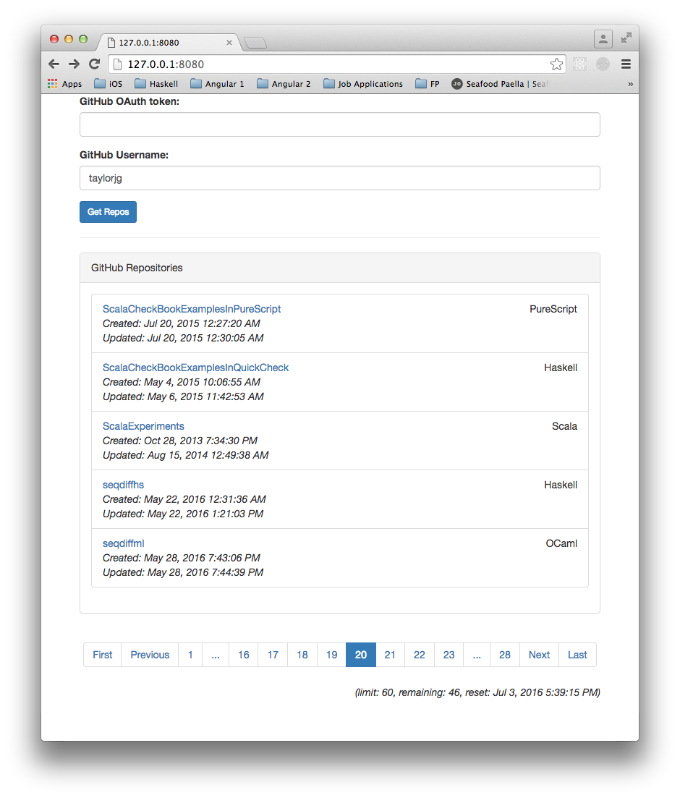
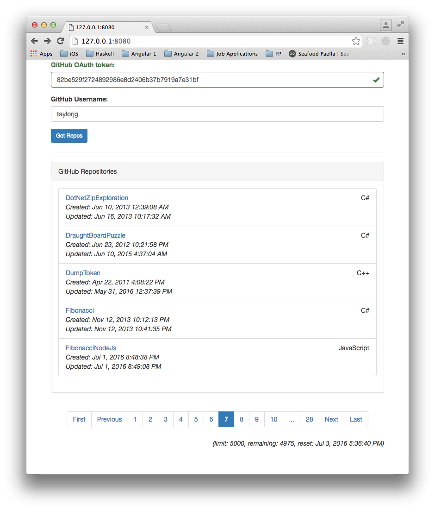

## Description

This repo is a little application to browse GitHub repos.

## TODO

* ~~Implement authentication HTTP interceptor~~
* Implement spinner HTTP interceptor
* Implement error handling HTTP interceptor
* ~~Display rate limit/remaining values~~
* ~~Add ability to page through the repos~~
    * Select page size ?
* Add ability to sort repos
    * e.g. by created_at/updated_at ascending/descending
* Implement filtering (using a filter ?)
* Show some user details too ? (e.g. fullname, avatar, etc.)
* Show more repo details
    * ~~url~~
        * => new tab/window ?
    * ~~language~~
    * ~~created_at~~
    * ~~updated_at~~
* Add a link for each repo to show even more detailed information in a modal/card
    * issues
    * branches
    * languages
    * releases
    * list of files
* Switch to a cards-based UI ?
    * See [BootCard](http://bootcards.org/)
* Add unit tests (Karma/Jasmine)
* Add end-to-end tests (Protractor)
* Support deep linking
* Convert JavaScript code to ES2015
    * Add gulpfile etc.

## Screenshots

### Unauthenticated

From the [Getting Started guide](https://developer.github.com/guides/getting-started/):

> Unauthenticated clients can make 60 requests per hour

### Authentication using an OAuth Token

Again, from the [Getting Started guide](https://developer.github.com/guides/getting-started/):

> When authenticating, you should see your rate limit bumped to 5,000 requests an hour

_(the token in the screenshot is no longer valid)_

## Links

* https://angularjs.org/
* http://getbootstrap.com/
* https://angular-ui.github.io/bootstrap/
* http://bootcards.org/
* https://developer.github.com/guides/
* https://developer.github.com/guides/discovering-resources-for-a-user/
* https://developer.github.com/guides/traversing-with-pagination/
* https://github.com/settings/tokens
* https://www.npmjs.com/package/http-server
* https://github.com/johnpapa/angular-styleguide
