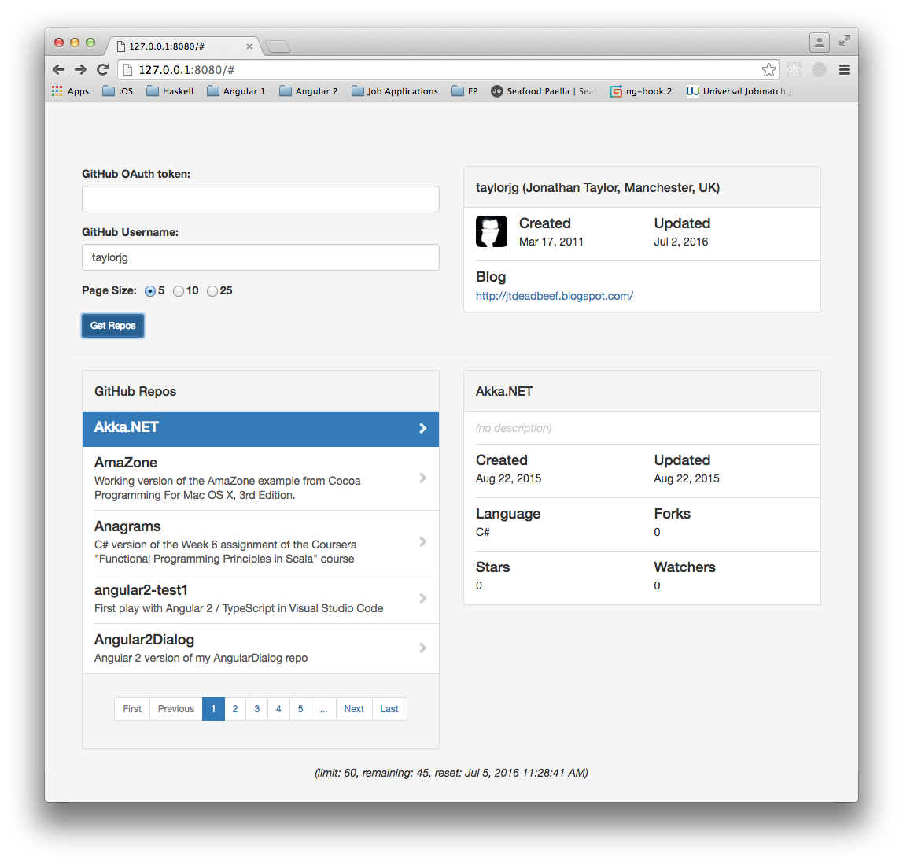
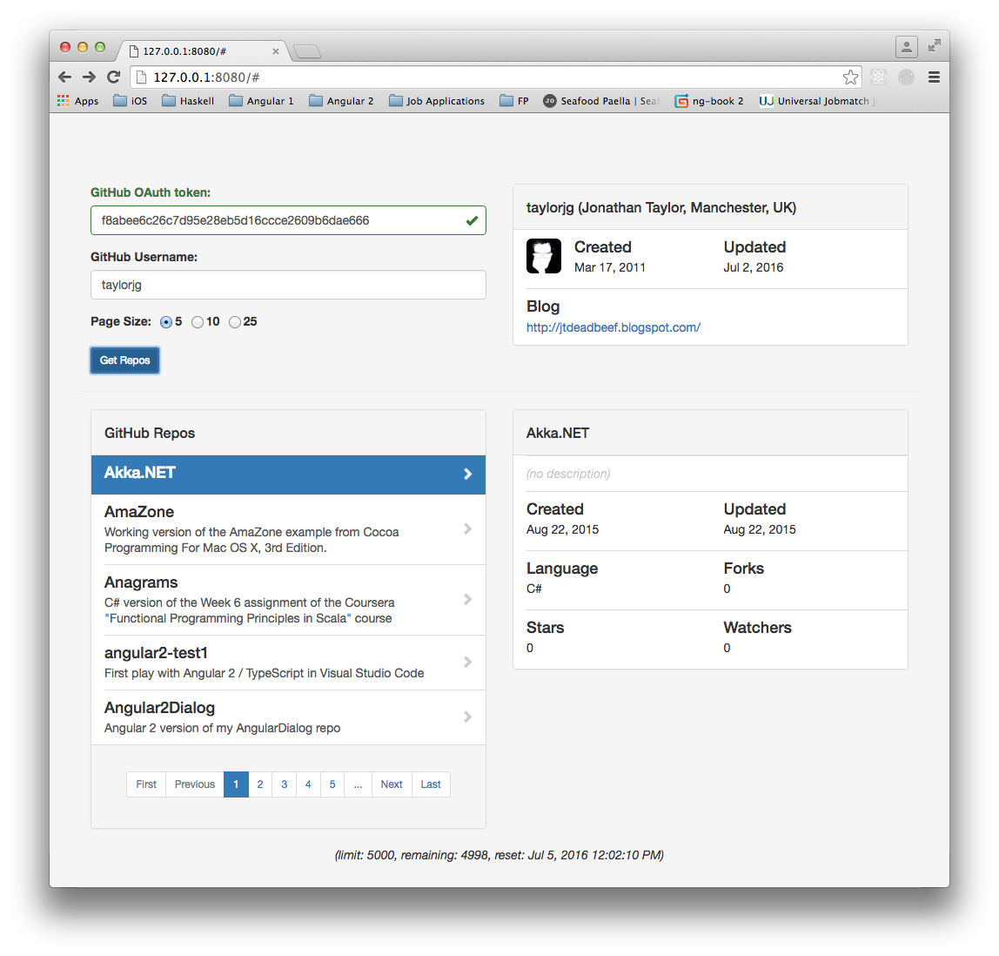
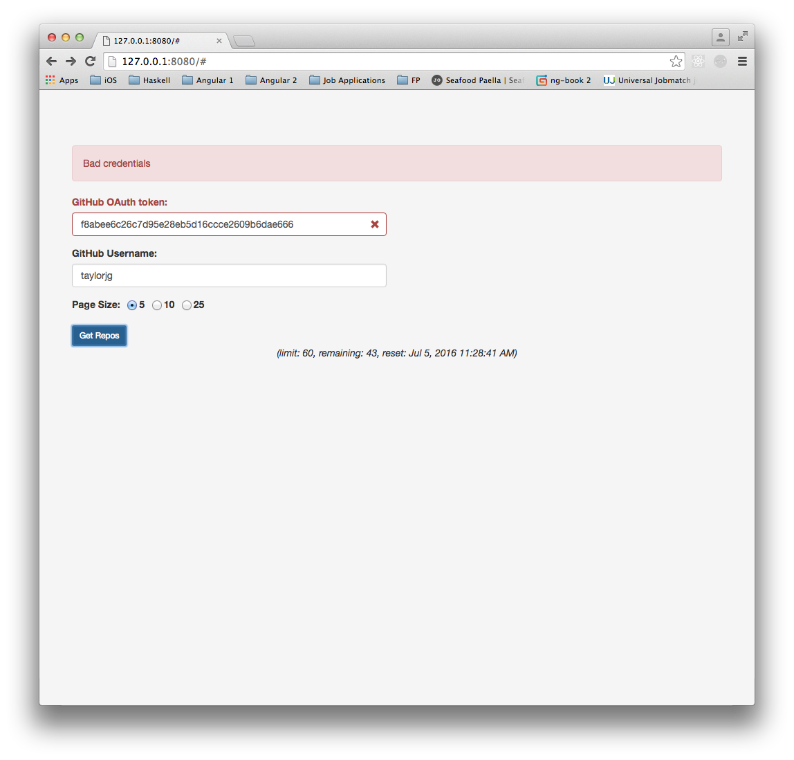

## Description

This repo is a little application to browse GitHub repos.

## TODO

* ~~Implement authentication HTTP interceptor~~
* ~~Implement spinner HTTP interceptor~~
* ~~Implement error handling HTTP interceptor~~
* ~~Display rate limit/remaining values~~
* ~~Add ability to page through the repos~~
    * ~~Select page size ?~~
* ~~Add ability to sort repos~~
    * ~~by: created / updated / pushed / full_name, direction: asc/desc~~
    * ~~See [List user repositories](https://developer.github.com/v3/repos/#list-user-repositories)~~
* Implement filtering
* ~~Show some user details too ? (e.g. fullname, avatar, etc.)~~
* ~~Show more repo details~~
    * ~~url~~
        * => new tab/window ?
    * ~~language~~
    * ~~created_at~~
    * ~~updated_at~~
* Add a link for each repo to show even more detailed information in a modal/card
    * issues
    * branches
    * ~~languages~~
    * releases
* ~~Make the error panel dismissible~~
* ~~Switch to a cards-based UI ?~~
    * ~~See [BootCard](http://bootcards.org/)~~
* Refactor chunks of markup into directives
    * User details
    * Repo summary
    * Repo details
* Build in some caching re GitHub API calls ?
    * See [Conditional requests](https://developer.github.com/v3/#conditional-requests) 
* Add unit tests (Karma/Jasmine)
* Add end-to-end tests (Protractor)
* Support deep linking
* Convert JavaScript code to ES2015
    * Webpack/gulp etc.

## Screenshots

### Unauthenticated

From the [Getting Started guide](https://developer.github.com/guides/getting-started/):

> Unauthenticated clients can make 60 requests per hour

### Authentication using an OAuth Token

From the [Getting Started guide](https://developer.github.com/guides/getting-started/):

> When authenticating, you should see your rate limit bumped to 5,000 requests an hour

#### Valid OAuth Token

_(the token in the screenshot is no longer valid)_

#### Invalid OAuth Token

## Links

* https://angularjs.org/
* http://getbootstrap.com/
* https://angular-ui.github.io/bootstrap/
* http://bootcards.org/
* https://developer.github.com/guides/
* https://developer.github.com/guides/discovering-resources-for-a-user/
* https://developer.github.com/guides/traversing-with-pagination/
* https://github.com/settings/tokens
* https://www.npmjs.com/package/http-server
* https://github.com/johnpapa/angular-styleguide
